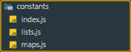

## 2025-03-19

### 🔍 고민 내용

#### 1. Props 필터 로직에 쓰이는 상수 정리

변하지 않는 **맵/리스트 구조**를 따로 관리



-   위치: `/src/constants`
-   파일:
    -   `index.js`: `lists.js`, `maps.js`의 `export`경로 **and** `lists.js, maps.js`을 조합한 새로운 맵 `export`
    -   `lists.js`: 검증에 필요한 리스트 정리
    -   `maps.js`: 검증에 필요한 맵 정리
-   목적: **가독성 향상 + 재사용 용이 + 유지보수 용이**

<details> 
<summary> ${\textsf{\color{magenta}{e.g., code view}}}$ </summary>

> 
>
> <details>
> <summary> ${\textsf{\color{magenta}{index.js}}}$ </summary>
>
> ```javascript
> import { flexCssList, gridCssList, tableCssList, commonCssList } from './lists'
> export * from './lists'
> export * from './maps'
>
> export const displayListMap = {
>     flex: flexCssList,
>     grid: gridCssList,
>     table: tableCssList,
>     common: commonCssList,
> }
> ```
>
> </details>
>
> <details>
> <summary> ${\textsf{\color{magenta}{lists.js}}}$ </summary>
>
> ```javascript
> /** INDEX `${name}List`
> * tableTag
> * display
> * onEvent
> * pseudoClass
> * pseudoElement
> * allPseudo
> *
> * -- display group match css property --
> * flexCss
> * gridCss
> * tableCss
> * commonCss
> */
>
> export const tableTagList = ['table', 'caption', 'thead', 'tfoot', 'tbody', 'colgroup', 'tr', 'td', 'th', 'col']
>
> export const ...
> ```
>
> </details>
>
> <details>
> <summary> ${\textsf{\color{magenta}{maps.js}}}$ </summary>
>
> ```javascript
> /** INDEX `${name}Map`
> * displayGroup
> * tableDisplay
> */
>
> export const displayGroupMap = {
>    flex: ['flex', 'inline-flex'],
>    grid: ['grid', 'inline-grid'],
>    table: ['table', 'inline-table', 'table-row-group', 'table-header-group', 'table-footer-group', 'table-row', 'table-cell', 'table-column', 'table-column-group', 'table-caption'],
>    common: ['block', 'inline', 'inline-block', 'flow-root', 'list-item'],
> }
> export const ...
> ```
>
> </details>

</details>

#### 2. 테마 스타일 구조 설계 및 SASS 도입

-   기존: inline 스타일 또는 스타일 객체 방식 한계
-   변경: **SASS 도입 → 미리 정의된 스타일 세트 적용 방식**

#### 3. props → variant, color, tone으로 스타일 분기

-   컴포넌트에 전달된 props를 기반으로 SASS 클래스 적용
-   미리 정의된 클래스 구조:
