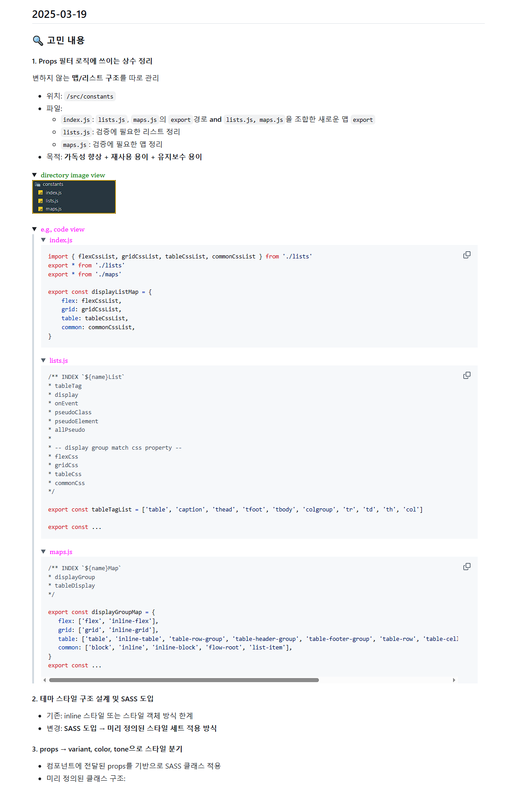

## 2025-03-19

### 🔍 고민 내용



#### 1. Props 필터 로직에 쓰이는 상수 정리

변하지 않는 **맵/리스트 구조**를 따로 관리

-   위치: `/src/constants`
-   파일:
    -   `index.js`: `lists.js`, `maps.js`의 `export`경로 **and** `lists.js, maps.js`을 조합한 새로운 맵 `export`
    -   `lists.js`: 검증에 필요한 리스트 정리
    -   `maps.js`: 검증에 필요한 맵 정리
-   목적: **가독성 향상 + 재사용 용이 + 유지보수 용이**

<details> 
<summary> ${\textsf{\color{green}{directory image view}}}$ </summary>


</details>

<details> 
<summary> ${\textsf{\color{magenta}{e.g., code view}}}$ </summary>

> <details>
> <summary> ${\textsf{\color{magenta}{index.js}}}$ </summary>
>
> ```javascript
> import { flexCssList, gridCssList, tableCssList, commonCssList } from './lists'
> export * from './lists'
> export * from './maps'
>
> export const displayListMap = {
>     flex: flexCssList,
>     grid: gridCssList,
>     table: tableCssList,
>     common: commonCssList,
> }
> ```
>
> </details>
>
> <details>
> <summary> ${\textsf{\color{magenta}{lists.js}}}$ </summary>
>
> ```javascript
> /** INDEX `${name}List`
> * tableTag
> * display
> * onEvent
> * pseudoClass
> * pseudoElement
> * allPseudo
> *
> * -- display group match css property --
> * flexCss
> * gridCss
> * tableCss
> * commonCss
> */
>
> export const tableTagList = ['table', 'caption', 'thead', 'tfoot', 'tbody', 'colgroup', 'tr', 'td', 'th', 'col']
>
> export const ...
> ```
>
> </details>
>
> <details>
> <summary> ${\textsf{\color{magenta}{maps.js}}}$ </summary>
>
> ```javascript
> /** INDEX `${name}Map`
> * displayGroup
> * tableDisplay
> */
>
> export const displayGroupMap = {
>    flex: ['flex', 'inline-flex'],
>    grid: ['grid', 'inline-grid'],
>    table: ['table', 'inline-table', 'table-row-group', 'table-header-group', 'table-footer-group', 'table-row', 'table-cell', 'table-column', 'table-column-group', 'table-caption'],
>    common: ['block', 'inline', 'inline-block', 'flow-root', 'list-item'],
> }
> export const ...
> ```
>
> </details>

</details>

#### 2. 테마 스타일 구조 설계 및 SASS 도입

-   기존: inline 스타일 또는 스타일 객체 방식 한계
-   변경: **SASS 도입 → 미리 정의된 스타일 세트 적용 방식**

#### 3. props → variant, color, tone으로 스타일 분기

-   컴포넌트에 전달된 props를 기반으로 SASS 클래스 적용
-   미리 정의된 클래스 구조:

## 2025-03-25

### 🔍 고민 내용

#### 1. 디렉토리 구조 개편

#### 2. keyframes 값을 스타일드 컴포넌트에 맞게 빌드하는 파일 작성

```js
const animationPropertyList = ['duration', 'easing', 'delay', 'iteration', 'direction', 'fillMode', 'playState']
const animationPropertySet = new Set(animationPropertyList)
const easingSet = new Set(['easing'])

function buildKeyframesBundle(keyframes) {
    /**
     * buildKeyframesBundle - Generates CSS animation and @keyframes from JS object input.
     *
     * 🔹 Main Function
     *   - keyframesAnalyze
     *
     * 🔸 Sub Function
     *   - exAnimation
     *   - nonAnimation
     *   - generateKeyframesCss
     *
     * 🔧 Assist Item
     *   - animationPropertyList
     *   - animationPropertySet
     *   - easingSet
     */

    const exAnimation = (name, value) => {
        const animation = `${name} ${value.animation}`

        return animation
    }

    const nonAnimation = (name, value) => {
        const animationProperty = {}

        forEachObject(value, (innerKey, innerValue) => {
            if (animationPropertySet.has(innerKey)) {
                animationProperty[innerKey] = innerValue
            }
        })

        const orderedValues = animationPropertyList.map((key) => animationProperty[key]).filter((value) => value !== undefined)

        const animation = [name, ...orderedValues].join(' ')

        return animation
    }

    const generateKeyframesCss = (obj) => {
        const result = {}

        forEachNestedObject(obj, (animationName, percent, styles) => {
            const propertyArray = []

            forEachObject(styles, (propKey, propValue) => {
                let patchKey

                if (easingSet.has(propKey)) {
                    patchKey = 'animationTimingFunction'
                } else {
                    patchKey = propKey
                }

                const kebabKey = camelToKebab(patchKey)
                propertyArray.push(`${kebabKey}: ${propValue};`)
            })

            const block = `    ${percent}% {\n        ${propertyArray.join('\n        ')}\n    }`

            if (!result[animationName]) result[animationName] = []
            result[animationName].push(block)
        })

        const patchResult = Object.entries(result)
            .map(([name, blocks]) => `@keyframes ${name} {\n${blocks.join('\n')}\n}`)
            .join('\n\n')

        return patchResult
    }

    function keyframesAnalyze(obj) {
        const animationArray = []
        const patchKeyframes = {}

        forEachObject(obj, (key, value) => {
            const getAnimation = typeof value.animation === 'string' ? exAnimation(key, value) : nonAnimation(key, value)

            animationArray.push(getAnimation)

            patchKeyframes[key] = value.percent
        })

        const animation = 'animation: ' + animationArray.join(', ')
        const css = generateKeyframesCss(patchKeyframes)

        console.log('%cAnimation', 'font-weight:bold', '\n' + animation)
        console.log('%cCSS', 'font-weight:bold', '\n' + css)

        return { animation, css }
    }

    const { animation, css } = keyframesAnalyze(keyframes)

    return { animation, css }
}
```

#### 3. transition 구조 고민

현재 `transition`은 `String`으로 입력하는것과 `Array`에 하나씩 입력하는 구조를 지원

변수값 코드: `const commonStyle = { one: '0.5s ease 1' }`

<details>
<summary> 현재 코드 </summary>

```js
transition: 'color 3s ease-in 1',
transition: [`color ${commonStyle.one}`, `background-color ${commonStyle.one}`],
```

</details>

중복속성을 편하게 적기 위해서 줄이기위해 한 것인데 결과적으로 2번 모두 따로 적는 불상사가 발생

그러므로 `Array`속에 객체를 두고 key이름은 `property` 값은 `value`로 두어

같은 `value`들은 `property`에 한번에 적어서 동시에 관리하면서, 배열에 일반 문자열도 넣게끔 구조를 개조하여 유연성을 확보해보려고함

여전히 `transition`에는 바로 `String`으로 써도 인식하지만 만약 `Array`형태일시 내부에 다시 객체와 스트링을 분석하고 재구조화하는 방향으로 설계하려고 함

<details>
<summary> 개선 코드 (미구현) </summary>

```js
transition: [{ property: 'color, backgroundColor', value: commonStyle.one }, `font-size 0.3s ease-in-out`]

// result: transition: color 0.5s ease 1, background-color 0.5s ease 1, font-size 0.3s ease-in-out;
```

</details>

## 2025-03-27

### 🔍 고민 내용

#### 1. styled-component 종속성 제거

기존은 css코드를 작성한 객체를 문자열로 변환해서 *styled-component*에 넘겨줌으로써 렌더링을 하는 방식이였으나

문자열로 변환해서 모든 상황의 css 코드를 만든다는건 굳이 *styled-component*가 필요 없지 않을까란 생각이 들게되었다

현재 방향성도 react의 hook 기능만을 제거하면 순수 javascript 문법들이 대부분이기에

*styled-component*를 제거하고 모든 태그에서 커스텀 ui를 제작하는 함수가 필요해졌음에 따라

`createItem`과 `styled` 함수를 추가하여 `createItem`은 각종 다양한 `BaseComponent`를 구성하게하고

`styled`는 원시태그나 `createItem`으로 만든 커스텀 컴포넌트를 넣고 `UInamic`의 엔진을 사용할 수 있게 하고자한다.

$\textit{\textsf{\color{magenta}{createItem.js}}}$

> <details>
>
> <summary> CODE </summary>
>
> ```js
> import propsFilterCore from '../propsFilterCore'
> import useDynamicTrigger from '../utils/useDynamicTrigger'
> import styledCore from '../styledCore'
>
> const voidElements = new Set(['area', 'base', 'br', 'col', 'embed', 'hr', 'img', 'input', 'link', 'meta', 'param', 'source', 'track', 'wbr'])
>
> const createItem = ({ type: defaultType = 'div', display: defaultDisplay = 'block', dynamicType: defaultDynamicType = undefined, baseStyle: defaultBaseStyle = {} } = {}) => {
>     return function GeneratedComponent({ children, type, display, dynamicType, dynamicStyle = {}, ...restProps }) {
>         const resolvedType = type || defaultType
>         const resolvedDisplay = display || defaultDisplay
>         const resolvedDynamicType = dynamicType || defaultDynamicType
>         const mergedStyle = { ...defaultBaseStyle, ...dynamicStyle }
>
>         console.log('mergedStyle:', mergedStyle)
>
>         const { style, other, className, dynamicTrigger, patchDisplay } = propsFilterCore({
>             type: resolvedType,
>             display: resolvedDisplay,
>             dynamicType: resolvedDynamicType,
>             props: restProps,
>             dynamicStyle: mergedStyle,
>         })
>         console.log('style:', style)
>         console.log('other:', other)
>
>         styledCore(style)
>
>         const { isTriggered, handleDynamicEvent } = useDynamicTrigger(dynamicTrigger)
>         const Tag = resolvedType
>         const baseProps = {
>             className: `${className || ''} ${isTriggered ? 'dynamic' : ''}`.trim(),
>             ...other,
>             style,
>             ...(resolvedDynamicType ? { [resolvedDynamicType]: handleDynamicEvent } : {}),
>         }
>
>         const renderTagWithoutChildren = () => <Tag {...baseProps} />
>         const renderTagWithChildren = () => <Tag {...baseProps}>{children}</Tag>
>
>         return voidElements.has(resolvedType) ? renderTagWithoutChildren() : renderTagWithChildren()
>     }
> }
>
> export default createItem
> ```
>
>  </details>

$\textit{\textsf{\color{magenta}{styled.js}}}$

> <details>
>
> <summary> CODE </summary>
>
> ```js
> import createItem from '../generators/createItem'
>
> const styled = (Base) => (styleFn) => {
>     const Component = typeof Base === 'string' ? createItem({ type: Base }) : Base
>
>     return function StyledComponent(props) {
>         const styleFromFn = typeof styleFn === 'function' ? styleFn(props) : styleFn || {}
>
>         const combinedStyle = {
>             ...styleFromFn,
>             ...props.dynamicStyle, // props 쪽이 우선
>         }
>
>         return <Component {...props} dynamicStyle={combinedStyle} />
>     }
> }
>
> export default styled
> ```
>
> </details>

#### 2. list.js와 sets.js 통합

sets.js에서 lists를 받아와서 연결하니 코드 가독성이 떨어지게되어

한 파일로 합하고 객체로 `{list, set}`을 같이 보내서 사용하는 방식으로 변경

$\textit{\textsf{\color{magenta}{list-set.js}}}$

<details>

<summary> CODE </summary>

> ```js
> /**
>  * 🔹 EXPORT STRUCTURE
>  * export const ${name} = { list, set }
>  *
>  * Includes:
>  * - tableTag
>  * - displayValue
>  * - pseudoClass
>  * - pseudoElement
>  * - allPseudo
>  * - onEventAll
>  *
>  * - baseProperty
>  * - flexProperty
>  * - gridProperty
>  * - tableProperty
>  *
>  * - mergedBaseProperty
>  * - mergedFlexProperty
>  * - mergedGridProperty
>  * - mergedTableProperty
>  *
>  * 🔹 DEFAULT EXPORT
>  * export default propsMap = { all above }
>  *
>  * 💡 USAGE:
>  * import props from 'path'
>  *
>  * props.baseProperty.list
>  * props.mergedGridProperty.set
>  * props.onEventAll.list
>  */
>
> export const tableTagList = ['table', 'caption', 'thead', 'tfoot', 'tbody', 'colgroup', 'tr', 'td', 'th', 'col']
>
> export const tableTagSet = new Set(tableTagList)
>
> export const displayValueList = [
>     'flex',
>     'inline-flex',
>     'grid',
>     'inline-grid',
>     'block',
>     'inline',
>     'inline-block',
>     'flow-root',
>     'list-item',
>     'table',
>     'inline-table',
>     'table-row-group',
>     'table-header-group',
>     'table-footer-group',
>     'table-row',
>     'table-cell',
>     'table-column',
>     'table-column-group',
>     'table-caption',
> ]
>
> export const displayValueSet = new Set(displayValueList)
>
> export const pseudoClassList = [
>     // Dynamic pseudo-classes
>     'active',
>     'focus',
>     'hover',
>     'focus-visible',
>     'focus-within',
>     'target',
>
>     // Link-related
>     'link',
>     'visited',
>     'any-link',
>
>     // Form/UI state
>     'checked',
>     'indeterminate',
>     'disabled',
>     'enabled',
>     'default',
>     'in-range',
>     'out-of-range',
>     'invalid',
>     'valid',
>     'optional',
>     'required',
>     'read-only',
>     'read-write',
>     'placeholder-shown',
>
>     // Structural
>     'empty',
>     'first-child',
>     'last-child',
>     'only-child',
>     'first-of-type',
>     'last-of-type',
>     'only-of-type',
>     'nth-child',
>     'nth-last-child',
>     'nth-of-type',
>     'nth-last-of-type',
>     'root',
>     'scope',
>
>     // Logical/selector
>     'not',
>     'is',
>     'where',
>
>     // Language/direction
>     'lang',
> ]
>
> export const pseudoClassSet = new Set(pseudoClassList)
>
> export const pseudoElementList = [
>     // Text styling pseudo-elements
>     'first-letter',
>     'first-line',
>     'selection',
>
>     // Generated content pseudo-elements
>     'before',
>     'after',
>
>     // Commonly supported experimental (조건부)
>     'placeholder',
> ]
>
> export const pseudoElementSet = new Set(pseudoElementList)
>
> export const allPseudoList = [...pseudoClassList, ...pseudoElementList]
>
> export const allPseudoSet = new Set(allPseudoList)
>
> export const flexPropertyList = ['display', 'flexFlow', 'flexDirection', 'flexWrap', 'justifyContent', 'alignContent', 'alignItems', 'alignSelf', 'justifySelf', 'placeItems', 'placeContent', 'placeSelf', 'gap']
> export const flexPropertySet = new Set(flexPropertyList)
>
> export const gridPropertyList = [
>     'display',
>     'gridTemplateColumns',
>     'gridTemplateRows',
>     'gridGap',
>     'alignItems',
>     'justifyContent',
>     'justifyItems',
>     'placeItems',
>     'placeContent',
>     'gridTemplateRows',
>     'gridTemplateColumns',
>     'gridTemplateAreas',
>     'gridTemplate',
>     'rowGap',
>     'columnGap',
>     'gap',
>     'gridAutoRows',
>     'gridAutoColumns',
>     'gridAutoFlow',
> ]
> export const gridPropertySet = new Set(gridPropertyList)
>
> export const tablePropertyList = ['colspan', 'rowspan', 'cellSpacing', 'cellPadding', 'borderCollapse', 'captionSide', 'emptyCells', 'tableLayout']
> export const tablePropertySet = new Set(tablePropertyList)
>
> const paddingList = ['padding', 'paddingTop', 'paddingRight', 'paddingBottom', 'paddingLeft']
> const paddingAbbrList = ['pd', 'pt', 'pr', 'pb', 'pl', 'py', 'px']
> const marginList = ['margin', 'marginTop', 'marginRight', 'marginBottom', 'marginLeft']
> const marginAbbrList = ['mg', 'mt', 'mr', 'mb', 'ml', 'my', 'mx']
> const borderList = ['border', 'borderTop', 'borderBottom', 'borderRight', 'borderLeft', 'borderRadius', 'outline']
> const borderAbbrList = ['bd', 'bt', 'br', 'bb', 'bl', 'by', 'bx']
> const colorList = ['color', 'backgroundColor', 'caretColor']
> const layoutList = ['width', 'height', 'maxWidth', 'minWidth', 'maxHeight', 'minHeight', 'aspectRatio', 'boxSizing', 'position', 'top', 'right', 'bottom', 'left', 'zIndex']
> const typographyList = ['fontSize', 'fontWeight', 'fontFamily', 'textAlign', 'lineHeight', 'letterSpacing', 'textDecoration']
> const effectList = ['boxShadow', 'opacity', 'transition', 'transform', 'willChange']
> const animationList = ['animation', 'animationName', 'animationDuration', 'animationTimingFunction', 'animationDelay', 'animationIterationCount', 'animationDirection', 'animationFillMode', 'animationPlayState']
> const interactivityList = ['cursor', 'pointerEvents', 'userSelect', 'tabIndex']
> const mediaList = ['objectFit', 'resize']
> const listPropertyList = ['listStyle', 'listStyleType', 'listStyleImage', 'listStylePosition']
> const miscList = ['whiteSpace', 'all']
> const customCssList = ['easing']
> const flexItems = ['order', 'flex', 'flexGrow', 'flexShrink', 'flexBasis', 'alignSelf', 'justifySelf']
> const gridItems = ['gridRowStart', 'gridRowEnd', 'gridRow', 'gridColumnStart', 'gridColumnEnd', 'gridColumn', 'gridArea', 'alignSelf', 'justifySelf', 'placeSelf', 'order', 'zIndex']
>
> export const basePropertyList = [
>     // 속성
>     ...paddingList,
>     ...paddingAbbrList,
>     ...marginList,
>     ...marginAbbrList,
>     ...borderList,
>     ...borderAbbrList,
>
>     ...colorList,
>     ...layoutList,
>     ...typographyList,
>     ...effectList,
>     ...animationList,
>     ...interactivityList,
>     ...mediaList,
>
>     ...listPropertyList,
>     ...miscList,
>     ...customCssList,
>     ...flexItems,
>     ...gridItems,
> ]
>
> export const basePropertySet = new Set(basePropertyList)
>
> const mouseEvent = ['onClick', 'onDoubleClick', 'onMouseDown', 'onMouseEnter', 'onMouseLeave', 'onMouseMove', 'onMouseOut', 'onMouseOver', 'onMouseUp', 'onContextMenu']
> const keyboardEvent = ['onKeyDown', 'onKeyPress', 'onKeyUp']
> const focusEvent = ['onFocus', 'onBlur', 'onFocusIn', 'onFocusOut']
> const formEvent = ['onChange', 'onInput', 'onInvalid', 'onSubmit', 'onReset']
> const touchEvent = ['onTouchCancel', 'onTouchEnd', 'onTouchMove', 'onTouchStart']
> const dragEvent = ['onDrag', 'onDragEnd', 'onDragEnter', 'onDragExit', 'onDragLeave', 'onDragOver', 'onDragStart', 'onDrop']
> const otherEvent = ['onWheel', 'onSelect', 'onCopy', 'onCut', 'onPaste', 'onLoad', 'onError', 'onPointerDown', 'onPointerMove', 'onPointerUp', 'onPointerCancel', 'onPointerEnter', 'onPointerLeave', 'onPointerOver', 'onPointerOut', 'onGotPointerCapture', 'onLostPointerCapture']
> const mediaEvent = [
>     'onAbort',
>     'onCanPlay',
>     'onCanPlayThrough',
>     'onDurationChange',
>     'onEmptied',
>     'onEncrypted',
>     'onEnded',
>     'onLoadedData',
>     'onLoadedMetadata',
>     'onLoadStart',
>     'onPause',
>     'onPlay',
>     'onPlaying',
>     'onProgress',
>     'onRateChange',
>     'onSeeked',
>     'onSeeking',
>     'onStalled',
>     'onSuspend',
>     'onTimeUpdate',
>     'onVolumeChange',
>     'onWaiting',
> ]
> const animationEvent = ['onAnimationStart', 'onAnimationEnd', 'onAnimationIteration', 'onTransitionEnd']
> const uiEvent = ['onScroll', 'onResize', 'onToggle']
> const compositionEvnet = ['onCompositionStart', 'onCompositionUpdate', 'onCompositionEnd']
>
> export const onEventAllList = [...mouseEvent, ...keyboardEvent, ...focusEvent, ...formEvent, ...touchEvent, ...dragEvent, ...otherEvent, ...mediaEvent, ...animationEvent, ...uiEvent, ...compositionEvnet]
>
> export const onEventAllSet = new Set(onEventAllList)
>
> export const tableTag = {
>     list: tableTagList,
>     set: tableTagSet,
> }
>
> export const displayValue = {
>     list: displayValueList,
>     set: displayValueSet,
> }
>
> export const pseudoClass = {
>     list: pseudoClassList,
>     set: pseudoClassSet,
> }
>
> export const pseudoElement = {
>     list: pseudoElementList,
>     set: pseudoElementSet,
> }
>
> export const allPseudo = {
>     list: allPseudoList,
>     set: allPseudoSet,
> }
>
> export const onEventAll = {
>     list: onEventAllList,
>     set: onEventAllSet,
> }
>
> export const baseProperty = {
>     list: basePropertyList,
>     set: basePropertySet,
> }
>
> export const flexProperty = {
>     list: flexPropertyList,
>     set: flexPropertySet,
> }
>
> export const gridProperty = {
>     list: gridPropertyList,
>     set: gridPropertySet,
> }
>
> export const tableProperty = {
>     list: tablePropertyList,
>     set: tablePropertySet,
> }
>
> export const mergedBaseProperty = {
>     list: [...basePropertyList],
>     set: new Set([...basePropertyList]),
> }
>
> export const mergedFlexProperty = {
>     list: [...basePropertyList, ...flexPropertyList],
>     set: new Set([...basePropertyList, ...flexPropertyList]),
> }
>
> export const mergedGridProperty = {
>     list: [...basePropertyList, gridPropertyList],
>     set: new Set([...basePropertyList, gridPropertyList]),
> }
>
> export const mergedTableProperty = {
>     list: [...basePropertyList, ...tablePropertyList],
>     set: new Set([...basePropertyList, ...tablePropertyList]),
> }
>
> const propsMap = {
>     tableTag,
>     displayValue,
>
>     pseudoClass,
>     pseudoElement,
>
>     allPseudo,
>     onEventAll,
>
>     baseProperty,
>     flexProperty,
>     gridProperty,
>     tableProperty,
>
>     mergedBaseProperty,
>     mergedFlexProperty,
>     mergedGridProperty,
>     mergedTableProperty,
> }
>
> export default propsMap
>
> export const styleGroupMap = {
>     padding: paddingList,
>     paddingAbbr: paddingAbbrList,
>     margin: marginList,
>     marginAbbr: marginAbbrList,
>     border: borderList,
>     borderAbbr: borderAbbrList,
>     layout: layoutList,
>     effect: effectList,
>     typography: typographyList,
>     color: colorList,
>     interactivity: interactivityList,
>     media: mediaList,
>     misc: miscList,
>     flexItem: flexItems,
>     gridItem: gridItems,
>     list: listPropertyList,
> }
> ```
>
> </details>
